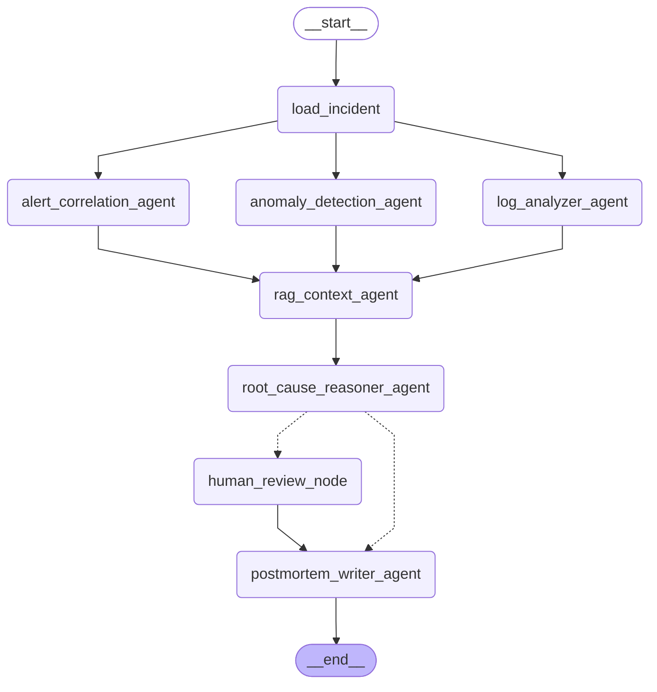

```mermaid
---
config:
  flowchart:
    curve: linear
---
graph TD;
	__start__([<p>__start__</p>]):::first
	load_incident(load_incident)
	log_analyzer_agent(log_analyzer_agent)
	anomaly_detection_agent(anomaly_detection_agent)
	alert_correlation_agent(alert_correlation_agent)
	rag_context_agent(rag_context_agent)
	root_cause_reasoner_agent(root_cause_reasoner_agent)
	human_review_node(human_review_node)
	postmortem_writer_agent(postmortem_writer_agent)
	__end__([<p>__end__</p>]):::last
	__start__ --> load_incident;
	alert_correlation_agent --> rag_context_agent;
	anomaly_detection_agent --> rag_context_agent;
	human_review_node --> postmortem_writer_agent;
	load_incident --> alert_correlation_agent;
	load_incident --> anomaly_detection_agent;
	load_incident --> log_analyzer_agent;
	log_analyzer_agent --> rag_context_agent;
	rag_context_agent --> root_cause_reasoner_agent;
	root_cause_reasoner_agent -.-> human_review_node;
	root_cause_reasoner_agent -.-> postmortem_writer_agent;
	postmortem_writer_agent --> __end__;
	classDef default fill:#f2f0ff,line-height:1.2
	classDef first fill-opacity:0
	classDef last fill:#bfb6fc
```
